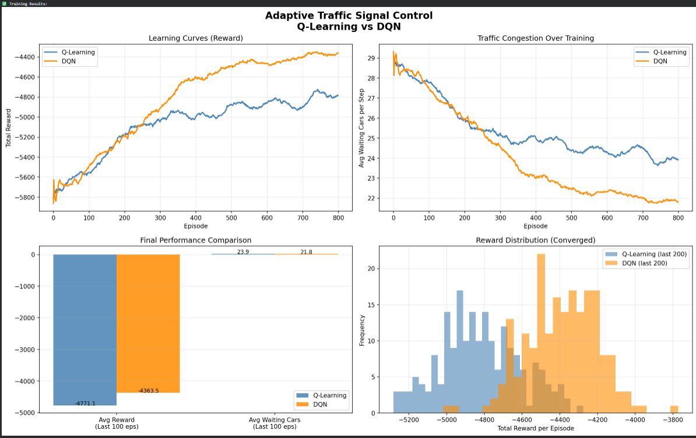
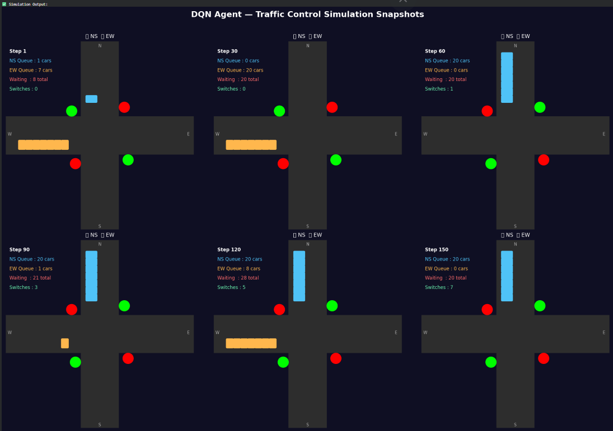

# 🚦 Adaptive Traffic Signal Control using Reinforcement Learning


> A Reinforcement Learning based system that intelligently controls traffic signals at a 4-way intersection to **minimize vehicle waiting time** — replacing fixed timers with an adaptive AI agent.

---

## 📌 Problem Statement

Traditional traffic signals use **fixed timing cycles** regardless of actual traffic conditions. This causes:
- Unnecessary waiting when one lane is empty
- No prioritization of heavy traffic
- Increased fuel consumption and congestion

This project solves this using **Reinforcement Learning** — training an agent to observe real-time traffic and decide when to switch signals.

---

## 🎯 Algorithms Implemented

| Algorithm | Type | Approach |
|---|---|---|
| **Q-Learning** | Classical RL | Tabular Q-table with state discretization |
| **Deep Q-Network (DQN)** | Deep RL | Neural network + Experience Replay + Target Network |

---

## 🌍 Custom Environment — TrafficEnv

Built from scratch using OpenAI Gymnasium.

| Component | Details |
|---|---|
| **State** | [NS Queue, EW Queue, Current Phase, Time in Phase] |
| **Actions** | 0 = Keep current signal, 1 = Switch signal |
| **Reward** | Negative total waiting cars: `r = -(NS + EW queue)` |
| **Episode** | 200 time steps |
| **Car Arrival** | Poisson distribution (rate = 2.0 cars/step) |
| **Phases** | Phase 0 = NS Green / EW Red, Phase 1 = EW Green / NS Red |

---

## 📊 Results

Both agents trained for **800 episodes**:

| Metric | Q-Learning | DQN |
|---|---|---|
| Avg Reward (last 100 eps) | -4771.1 | **-4363.5** |
| Avg Waiting Cars | 23.9 cars/step | **21.8 cars/step** |
| Best Episode Reward | -4207.0 | **-3963.0** |

> ✅ DQN reduced average vehicle waiting time by **~8.8%** over Q-Learning

---

## 🖼️ Output Visualizations

### Learning Curves + Comparison


### DQN Agent — Live Simulation Snapshots


---

## 🧠 Key Concepts

**Q-Learning Update (Bellman Equation):**
```
Q(s,a) ← Q(s,a) + α [r + γ max Q(s',a') − Q(s,a)]
```

**DQN Loss Function:**
```
L(θ) = E[(r + γ max Q(s',a'; θ⁻) − Q(s,a; θ))²]
```

**DQN Key Innovations:**
- 🔁 **Experience Replay** — breaks temporal correlation between samples
- 🎯 **Target Network** — stable TD targets, prevents divergence
- ✂️ **Gradient Clipping** — prevents exploding gradients

---

## 🚀 How to Run

### Option 1: Google Colab (Recommended)
1. Open [Google Colab](https://colab.research.google.com)
2. Upload `RL_Traffic_Signal_Control.ipynb`
3. Click **Runtime → Run All**
4. Training takes ~10 minutes on CPU

### Option 2: Local
```bash
git clone https://github.com/YOUR_USERNAME/adaptive-traffic-signal-rl
cd adaptive-traffic-signal-rl
pip install gymnasium torch matplotlib numpy
jupyter notebook RL_Traffic_Signal_Control.ipynb
```

---

## 📁 Project Structure

```
adaptive-traffic-signal-rl/
│
├── RL_Traffic_Signal_Control.ipynb   # Main notebook (all code)
├── README.md                          # This file
│
└── outputs/
    ├── comparison_plot.png            # 4-panel results comparison
    └── simulation_snapshots.png       # DQN agent simulation
```

---

## 🛠️ Tech Stack

- **Python 3.10+**
- **PyTorch** — DQN neural network
- **OpenAI Gymnasium** — custom environment
- **Matplotlib** — visualizations & simulation
- **NumPy** — numerical computations
- **Google Colab** — training platform

---


## 📚 References

- Mnih et al. (2015). Human-level control through deep reinforcement learning. *Nature*
- Sutton & Barto (2018). Reinforcement Learning: An Introduction. *MIT Press*
- Abdulhai et al. (2003). Reinforcement learning for adaptive traffic signal control. *IEEE*
- OpenAI Gymnasium Docs: https://gymnasium.farama.org/

---

## ⭐ Star this repo if you found it useful!
